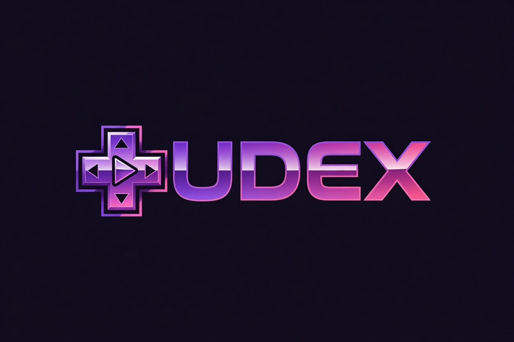

# Ludex

**Your retro library in one place. Multi-emulator, fullscreen, with beautiful cards and native controller support.**

🌍 **[English](README.en.md)** · [Português](README.md)

---

A Switch/PS5-style launcher that centralizes all your emulators in one place:

- Switch (Yuzu), Wii U (Cemu), 3DS (Citra), Wii & GameCube (Dolphin), PS3 (RPCS3), PS2 (PCSX2), PS1 (DuckStation), Xbox (xemu), N64, Genesis, SNES, NES, GBA, GB/GBC and more
- Covers + automatic screenshots via IGDB
- Multiple profiles with isolated saves (NTFS junctions)
- Playtime, sessions, local achievements and **RetroAchievements** integration
- Ambient music, Discord Rich Presence, auto-update
- **6 UI languages** (English, Português, Español, Français, 中文, Русский) — switch anytime in Settings
- 10 ready-made avatars + explanatory tour on first run
- Fully **controller-navigable** (on-screen keyboard, dialogs and menus)

## 💜 Buy

Ludex is a paid app — **one license, lifetime access, up to 2 PCs**, no subscription:

➡️ **[pauloadriel98.gumroad.com/l/ludex](https://pauloadriel98.gumroad.com/l/ludex)** (R$ 49,90)

You receive a license key by email. Paste it on first launch and the app is yours forever.

## 📥 Download

Grab the installer from the [latest release](https://github.com/Paulothedeveloper/ludex/releases/latest):

- **Windows 10/11 (x64):** `Ludex_X.Y.Z_x64-setup.exe`

Run the `.exe` and follow the steps (it asks for admin to install to `C:\Program Files\Ludex`). From then on Ludex updates itself.

## ⚙️ Requirements

- **Windows 10 build 1809+** or **Windows 11**
- **Microsoft Visual C++ Redistributable 2015-2022 (x64)** — https://aka.ms/vs/17/release/vc_redist.x64.exe
- **WebView2 Runtime** (built into Windows 11)
- Optional: dedicated NVIDIA/AMD GPU for heavy emulators (PS3, Switch, Wii U)

## ⚠️ Important

- Ludex **does not distribute ROMs or BIOS**. Use only games you legally own.
- External emulators (Yuzu, Dolphin, PCSX2…) are third-party programs you install separately. Ludex only launches them with the right game.
- Embedded libretro cores (SNES, NES, GBA, GB, Genesis, N64, PS1…) run *inside* Ludex.

## 🎮 First run

1. Open Ludex and pick your language
2. An explanatory **tour** shows each part of the home
3. **Create your profile**: name + one of 10 avatars (or your own photo)
4. The home opens with your systems listed

## ⌨️ Shortcuts

| Key | Action |
|---|---|
| `←` / `→` | Switch platform |
| `↑` / `↓` | Navigate games |
| `Enter` | Open game |
| `F` | Favorite / unfavorite |
| `R` | Random game |
| `S` or `Esc` | Settings |
| `/` | Search |

## 👤 About the developer

**Paulo** is a Brazilian video producer and indie developer. Ludex started as a personal project to bring all his retro consoles together into one clean, console-like launcher — and grew into a polished app he now shares with the world. He builds in the open and listens to the community (this English UI exists because a user asked for it 💜).

 

## 📜 License

App code MIT. Libretro cores keep their own licenses. Console logos/marks belong to their respective owners — used here for reference only.

---

📧 [paulothedeveloper@protonmail.com](mailto:paulothedeveloper@protonmail.com) · 📸 [Instagram](https://instagram.com/paulo.videodev) · 💼 [LinkedIn](https://www.linkedin.com/in/paulo-adriel/) · 🐙 [github.com/Paulothedeveloper](https://github.com/Paulothedeveloper)

